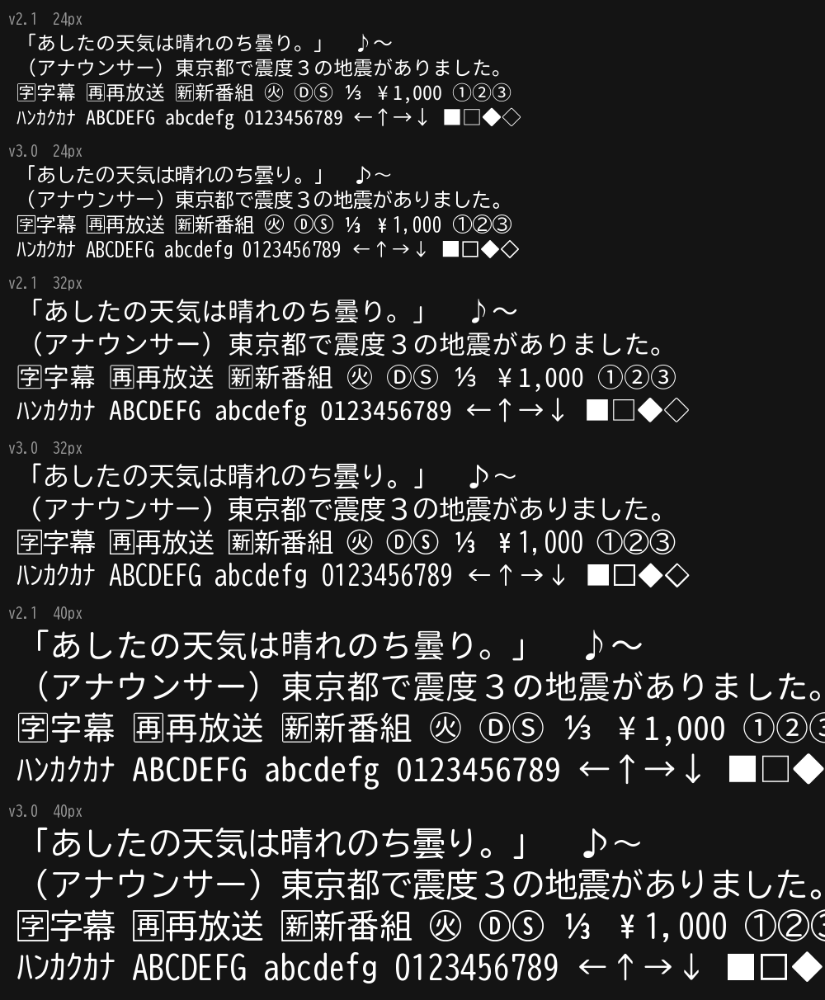
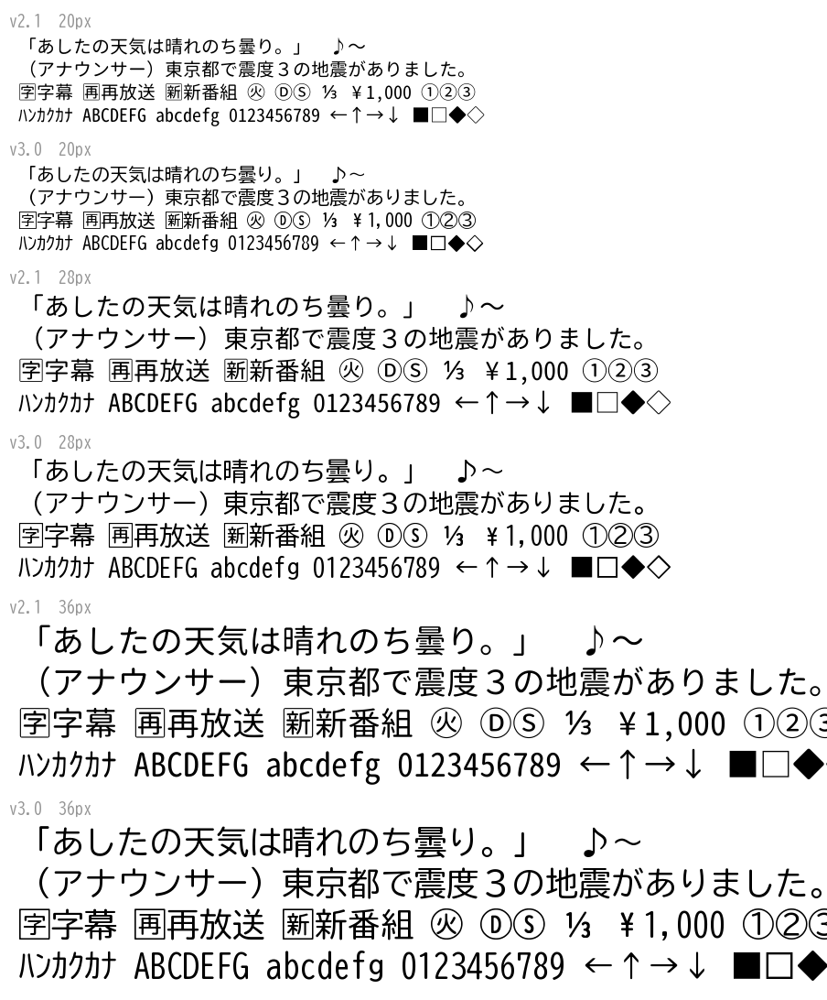
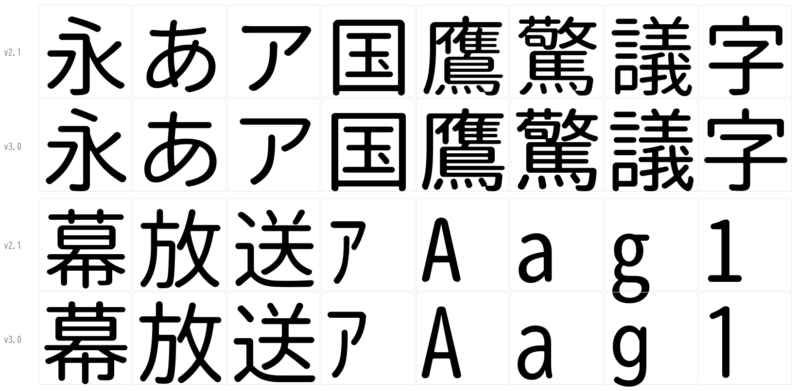
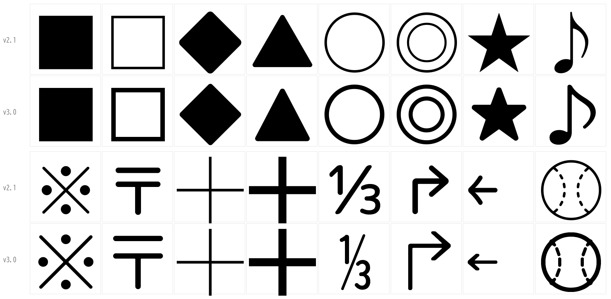
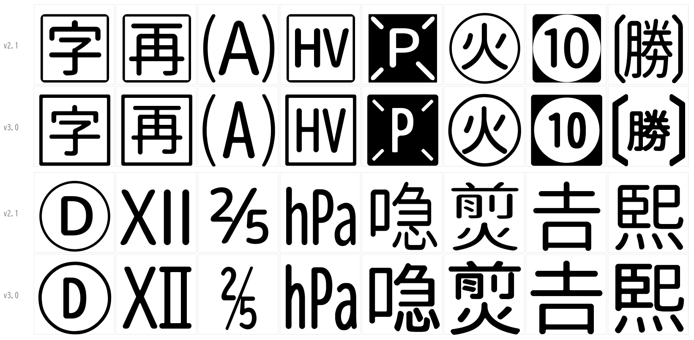
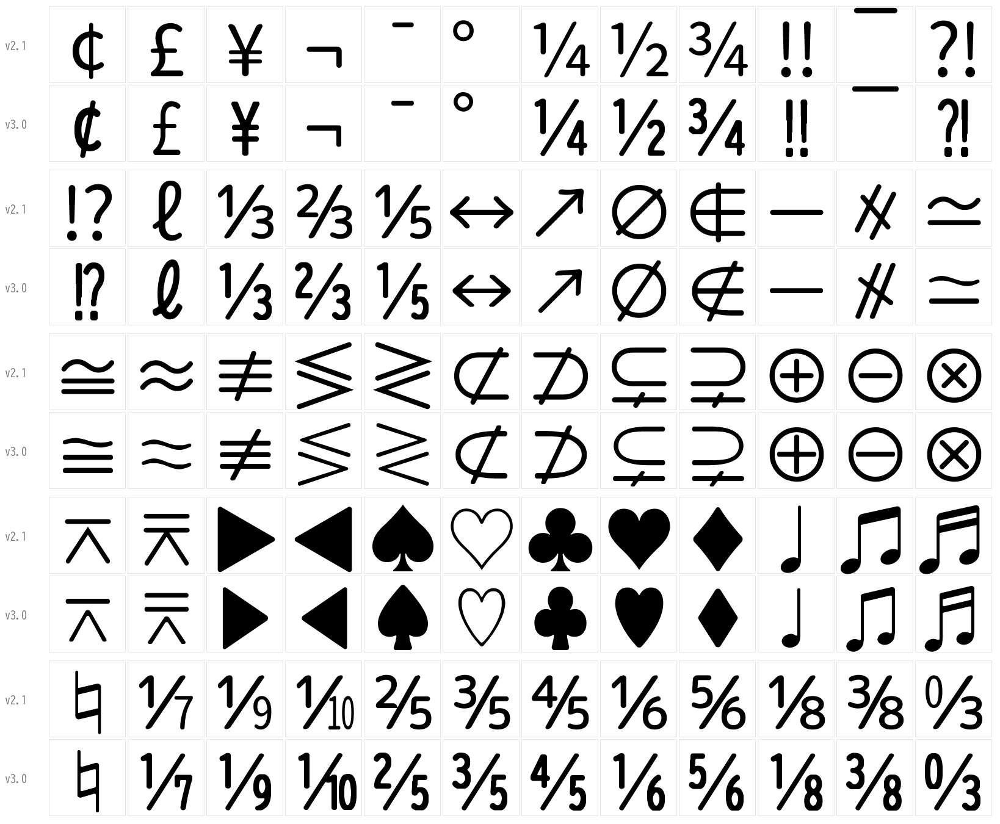

# Denpa Font

放送の字幕・データ放送・番組表で使う字 (JIS X 0208 と ARIB の外字など) を収めた、等幅の丸ゴシックです。
BIZ UDゴシック (モリサワ) の角を機械で丸め、元に無い ARIB の記号などを BIZ UDゴシックの字の部品と線の太さで描き足しています。

| | |
| --- | --- |
| ファミリ名 | `Denpa Font` |
| PostScript 名 | `DenpaFont-Regular` |
| em | 1024 (半角は半分の 512) |
| 入手 | [Releases](https://github.com/danything/denpa-font/releases) |
| ライセンス | [SIL Open Font License 1.1](LICENSE) |

| ファイル | 用途 |
| --- | --- |
| `denpa-font.ttf` | TrueType (fontconfig・Android など) |
| `denpa-font.woff2` | web フォント (ブラウザ) |
| `SHA256SUMS` | 上の2つの sha256 |

見本 (上: v2.1、下: v3.0):








## 名前

元にしていた「Rounded M+ 1m for ARIB」を入れている環境とぶつからないように、別の名前 (Denpa Font) にしています。
BIZ UDゴシックの許諾には予約フォント名がありませんが、元と取り違えないよう BIZ・UD の名は使っていません。

## 収めた字の範囲

**denpa の表だけを元にします。** [fetch.sh](fetch.sh) が [danything/denpa](https://github.com/danything/denpa) の表を版 (コミット) を固定して取り
(`DENPA_COMMIT`。Renovate が追う)、道具がそれを読みます。フォント側に表の写しは持ちません。

| 何のための字 | denpa の表 |
| --- | --- |
| 字幕 | `src/lib/ts/b24-tables.ts` (JIS X 0208 の割り当てのある区点、外字 85・86・90〜94 区、かな・英数・記号。漢字は EUC-JP との差分なので、EUC-JP は WHATWG の index-jis0208 で読む) |
| DRCS (局が絵で送る字) | 同じく `DRCS_REPLACE` の置き換え先 |
| 番組表などの外字 | `src/lib/ts/aribtext-gaiji.ts` (`EPG_ONLY`。ほかは字幕の追加記号と同じ) と、検索の寄せた先 (`src/lib/fold.ts` の `FOLD`) |
| データ放送 | `package.json` の web-bml の版の `jis_to_unicode_map.js` (npm から取り、denpa の `bun.lock` の sha512 で確かめる) と ASCII |

- 表はいずれ 1 つのファイルにまとまる予定なので、表の名前 (`HIRAGANA`・`GAIJI` など) をどのファイルからでも探します
- U+EC00〜ECBB は除きます (web-bml が自前で描く)
- 7,755 字。全部入っています ([missing.txt](missing.txt) は空)。ttf 4.1MB・woff2 1.5MB
- 送り幅は半角 512・全角 1024 だけ。どの字が半角かは v2.x と同じ (BIZ UDゴシックで半角の ½ ▶ ♠ ≈ などは全角にし、v2.x と同じ大きさに広げて線の太さを補う。分数は数字と斜線を全角の大きさに組む。全角の ° は半角にする)
- 行の高さは v1.x と同じ (WinAscent 981 / WinDescent 168)。字幕は「永」の墨の上下で縦の位置を決めるので (denpa)、元が替わっても字幕の縦の真ん中は変わりません
- カラー絵文字が既定の字 (🅿 ♨ ☎ ⚡ ⛅ ❗ ⁉ など) も白黒の形で入っています (`verify` が空白のほかに形の無い字が無いことを確かめる)
- ヒンティング (TrueType の命令) は持ちません。縦書きと OpenType の組版 (vhea/vmtx/GSUB/GPOS) も持ちません

**字を足す流れ:** denpa の表に 1 行足す → denpa の CI が「フォントに無い字」を出して落ちる →
こちらの `DENPA_COMMIT` を上げる (Renovate の PR) → 元に無い字なら [data/parts.txt](data/parts.txt) に部品の組み方を足す
(図形で描くなら `tools/src/draw.rs`) → タグを打って版を出す → denpa のフォントの版 (と sha256) を上げる。

## 元にしたフォント

| フォント | 版 | 配布元 |
| --- | --- | --- |
| BIZ UDゴシック Regular | 1.051 | <https://github.com/googlefonts/morisawa-biz-ud-gothic> (リリース v1.051 の `BIZUDGothic.zip`) |

使うのは GitHub で OFL 1.1 で配られているものだけです (Windows に入っている BIZ UDゴシックは別の許諾なので使いません)。
配布元の書庫 (`BIZUDGothic.zip`、sha256 `30692df621b92df13b88f1360aed1ab6ae50de441bce751a396c6439045cd759`) から出した ttf と、
同じリポジトリのタグ v1.051 の許諾文 (`OFL.txt`) を、このリポジトリのリリース
[source-bizudgothic-1.051](https://github.com/danything/denpa-font/releases/tag/source-bizudgothic-1.051) に置き、
[fetch.sh](fetch.sh) はそこから取って sha256 で照らします。元のフォントは em 2048 なので、半分 (em 1024) にして使います。

**元フォントの版上げ:** fetch.sh の `BIZ_VERSION` は Renovate が上流の GitHub リリースのタグを追い、新しい版が出ると PR を出します。
sha256 は Renovate では書き換えられないので、その PR のブランチへの push で [source-bump.yml](.github/workflows/source-bump.yml) が動き、
上流の zip と許諾文を取って sha256 を測り、リリース `source-bizudgothic-<版>` に置き、fetch.sh の sha256 を書き換えてコミットします
(GitHub Apps・デプロイキーは使わず GITHUB_TOKEN だけ。許諾文に予約フォント名が足されていたら止まる)。
GITHUB_TOKEN の push では CI が動かないので、同じワークフローがそのコミットを build.yml で確かめ、必須チェック (build・claude-review) の status を付けます。
動かなかったときは、Actions の source-bump を `workflow_dispatch` でそのブランチを渡して回します。
**字の形が変わるので自動ではマージしません。** CI のジョブの要約 (前の版から描き方が変わった字) と見本 (artifact の `changes`) を見て、人が入れます。

## 作り方

**丸め方** (`tools/src/fillet.rs`): BIZ UDゴシックの字は、輪郭のまま角ごとに円弧を入れます。

- 出っ張った角は半径 41 (em の 4%)、へこんだ角は半径 12。円弧は2次曲線 (曲がりが 60° を超える角は2本) で近づけます
- 角の両側の辺が短くて半径どおりの円弧が入らないとき (細い線の端など) は、辺の半分まで使える半径に小さくします。
  細い線の端は両側の角が辺を半分ずつ使うので、線の太さの半円になります
- 元の点はそのまま運ぶので、点の数は角 1 つにつき 2〜3 増えるだけです (元の字は輪郭が重ならないように整えてあるので、角ごとに丸められる)。
  丸めた輪郭どうしが交わる字 (近い線の角が重なる 浚 瀰 礫 騙) は、描いた字と同じく格子で丸めます
- 角を残す字は [data/sharp.txt](data/sharp.txt): 源柔ゴシック (v2.x の元) が角を残していた罫線と ■ □、それを元に描いた ⬛ ⌺ ⛋ ⛝ ⛞ ￭

**元に無い字** (作り方の一覧はビルドのたびに `build/extras.txt` に出る):

| 作り方 | 字 | 数 |
| --- | --- | --- |
| 同じ字形を指す | データ放送の外字の私用領域 (U+E0xx〜E3xx)。denpa の表で同じ区点の字。互換漢字 恵 舘 𤋮 (U+FA6B〜FA6D) は元の字へ | 128 |
| 部品を組む ([data/parts.txt](data/parts.txt)) | 囲み文字 (🄐〜🉈・㉄〜㉏・Ⓓ Ⓢ ㊋ など)、分数、半角の ￩〜￮、↱ ↴、⒑〜⒓、㍱ ㏊、漢字 27 字 (喼 䃯 鿅 𤋎 𠮷 𤋮 など)、半角と全角の幅を v2.x にそろえる字 | 220 |
| 楽器の略記 | 92区56〜85 の (vn) (ob) … (pe r)。元の半角の字を横 50%・縦 80% にして 1 マスに並べる | 30 |
| 描く (`tools/src/draw.rs`) | 天気・道路・地図の記号など ⛄ ⛅ ⚡ ⛔ ⛩ ⚾ … | 79 |

部品の組み方 (`data/parts.txt`) は 1 字 1 行で、BIZ UDゴシックの字 (使う輪郭の番号・切り抜く枠) と、置く枠を書きます。
組むのは格子 (em 1024 を 512 マスに。1 マス 2 単位) の上で、部品を縮めて細った線は、縮めた向きにだけ膨らませて元の太さ (漢字は 84) に戻してから、
ほかの字と同じ半径で丸めます (`tools/src/round.rs`。描いた字も同じ)。格子から引いた等高線は直線と2次曲線に当てはめ直します (`tools/src/fit.rs`)。

**ヒンティングを持たない理由:** 字幕・データ放送を描くところは、どれもフォントの TrueType の命令を使わずに描きます。
Android (Android TV・denpa-tv) と Chrome の Linux 版は FreeType の自動ヒンティング (light) で縦だけを合わせ、macOS・iOS はヒンティングをしません。
Windows のブラウザ (DirectWrite) もヒンティングの無いフォントをなめらかに描きます。字幕は 1 字 20px より大きく描くので、命令が無くても線は潰れません。
v2.x も字ごとの命令は持っていませんでした (源柔ゴシックの `fpgm`・`prep` が残っていただけ)。ttfautohint などの道具も増やしません。

## ビルドとリリースの仕方

取ってくる・確かめる・ほどくのは [fetch.sh](fetch.sh) (curl・sha256sum・openssl・tar)、フォントを作るのは Rust の道具 1 本
([tools/](tools)。依存は fontations の skrifa・write-fonts と woff2 の ttf2woff2 だけ。道具はネットに触らない)。
Rust の版は [rust-toolchain.toml](rust-toolchain.toml)、依存は `tools/Cargo.lock` で固定してあります。同じ入力から同じバイト列ができます。
字ごとに並べて作り (スレッドの数は `DENPA_THREADS`、無ければ CPU の数)、4 スレッドで 5 秒ほどです。

```sh
sh fetch.sh                                   # build/src に取ってくる
cargo build --release --locked --manifest-path tools/Cargo.toml
tools/target/release/denpa-font build 3.0     # → dist/denpa-font.ttf・.woff2
tools/target/release/denpa-font verify dist/denpa-font.ttf [--prev 前の版の ttf] [--woff2 woff2 を解いた ttf]
tools/target/release/denpa-font repertoire    # 収める字の一覧を見る
DENPA_ONLY='永あ①' tools/target/release/denpa-font build 3.0   # 試すとき: 書いた字だけ作る
```

SHA256SUMS は CI のシェルが作ります。fontations には WOFF2 を書き出すものが無いので woff2 は ttf2woff2 で作り、ttf2woff2 が勧めるとおり出力を確かめるため、CI が Google の `woff2_decompress` で解いて ttf と比べます。

`verify` が確かめること (PR・main・タグのたびに CI が動かす。止めるのは機械で決まるものだけ):

- 字の揃い (denpa の表の字が全部ある。[missing.txt](missing.txt) の字を除く)、空白のほかに形の無い字が無いこと、送り幅が 512 か 1024 であること
- 名前・em
- 前の版から描き方が変わった字の一覧と、前と今の字形を並べた見本 (`build/changes.svg`) を出す。**止めない** — 変わってよいかは PR を見る人が決める (一覧は CI のジョブの要約、見本は artifact の `changes`)
- woff2 を解いたものが ttf と同じ字になる

CI はほかに、同じ入力から 2 度作って同じバイト列になることを確かめます。

**版**: タグは `vX.Y` (例 `v3.0`)。元を替える・字を減らす・字の幅や行の高さを変えるときは X、字を足す・直すときは Y を上げます。フォントの版 (nameID 5) は `Version X.YYY`。タグを push すると GitHub Actions が作って確かめ、Releases に ttf・woff2・SHA256SUMS を置きます。

**以前のやり方**: v1.x は FontForge のスクリプトとコピーリスト、v2.0 は Python (fontTools) で、v2.1 から Rust の道具だけで作っています。
v2.x の元は源柔ゴシック等幅 (源ノ角ゴシック + M+ OUTLINE FONTS を丸めたもの) で、v3.0 で BIZ UDゴシックに替えました
(源柔ゴシックは 2015 年で止まっており、かなと英数が 2 系統混ざっていたため)。源柔ゴシックの ttf はリリース
[source-genjyuu-20150607](https://github.com/danything/denpa-font/releases/tag/source-genjyuu-20150607) に残してありますが、v3.0 からは使いません。

## ライセンス

このフォントと作るための道具は [SIL Open Font License 1.1](LICENSE) で配布しています (元の BIZ UDゴシックと同じ)。
元にした字形は BIZ UDゴシックの作者によるもので、元のフォントの著作権表示と許諾は次のとおりです。

### BIZ UDゴシック

```text
Copyright 2022 The BIZ UDGothic Project Authors (https://github.com/googlefonts/morisawa-biz-ud-mincho)

This Font Software is licensed under the SIL Open Font License, Version 1.1.
```

(許諾文の原文はリリース [source-bizudgothic-1.051](https://github.com/danything/denpa-font/releases/tag/source-bizudgothic-1.051) の `OFL.txt`。予約フォント名はありません。)

### クレジット

モリサワ (BIZ UDゴシック)。
v2.x は源柔ゴシック等幅 (Adobe の源ノ角ゴシック・M+ FONTS PROJECT の M+ OUTLINE FONTS・自家製フォント工房の源柔ゴシック) を、
v1.x は「Rounded M+ 1m for ARIB」(自家製 Rounded M+ 1m + 和田研中丸ゴシック2004ARIB) を元にしていました。v3.0 にはそれらの字形は入っていません。
