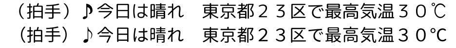
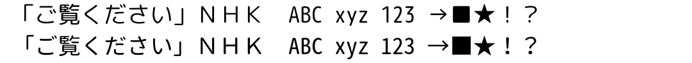
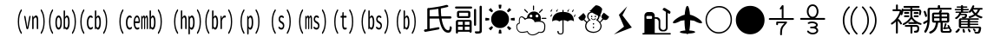

# Denpa Font

放送の字幕・データ放送で使う字 (JIS X 0208 と ARIB の外字など) を収めた、等幅の丸ゴシックです。
源柔ゴシック等幅 (源ノ角ゴシックを丸くしたもの) を元に、足りない ARIB の記号を和田研中丸ゴシックから足しています。

| | |
| --- | --- |
| ファミリ名 | `Denpa Font` |
| PostScript 名 | `DenpaFont-Regular` |
| em | 1024 (半角は半分の 512) |
| 入手 | [Releases](https://github.com/danything/denpa-font/releases) |
| ライセンス | [SIL Open Font License 1.1](LICENSE) |

| ファイル | 用途 |
| --- | --- |
| `denpa-font.ttf` | TrueType (fontconfig・Android など) |
| `denpa-font.woff2` | web フォント (ブラウザ) |
| `SHA256SUMS` | 上の2つの sha256 |

v1.x は「Rounded M+ 1m for ARIB」(自家製 Rounded M+ 1m + 和田研中丸ゴシック) を元にしていました。旧 `rounded-mplus-1m-arib.ttf` はコミット 4cee324 まで置いてあります。

見本 (上: v1.1、下: v2.0):




足した字 (楽器の略記・92区の漢字・和田研から写した記号など):



## 名前を変えた理由

元の「Rounded M+ 1m for ARIB」を入れている環境とぶつからないように、別の名前 (Denpa Font) にしました。
元の源ノ角ゴシックの予約フォント名 `Source` は名前に含めていません。

## 収めた字の範囲

[repertoire.txt](repertoire.txt) の 7,752 字に絞っています (ttf 4.2MB・woff2 1.5MB)。入っているのは 7,750 字です。

| 何のための字 | 出どころ |
| --- | --- |
| データ放送 | web-bml の JIS→Unicode 表と ASCII |
| 字幕 | JIS X 0208 の割り当てのある区点、外字 (85・86・90〜94 区)、かな・英数・半角記号 (denpa の `src/lib/ts/b24-tables.ts`) |
| DRCS (局が絵で送る字) | denpa が置き換える先の字 |

- U+EC00〜ECBB は除く (web-bml が自前で描く)
- 絞っても描き方は変わりません (`scripts/verify.py` が絞る前と全字を比べる)。ヒンティングは残し、縦書きと OpenType の組版 (vhea/vmtx/GSUB/GPOS) は落としています
- 行の高さは v1.x と同じ (WinAscent 981 / WinDescent 168)
- どの元にも無い字は [missing.txt](missing.txt) にあります (DRCS の置き換え先の漢字 2 字: 䃯 喼)。端末の字で出ます

一覧は denpa のチェックアウトで作り直せます。

```sh
cd denpa && bun install
bun ../denpa-font/scripts/repertoire.ts > ../denpa-font/repertoire.txt
```

## 元にしたフォントと足した字の出どころ

| | フォント | 版 | 配布元 | 使うもの |
| --- | --- | --- | --- | --- |
| 元 | 源柔ゴシック等幅 Regular | 1.002.20150607 | <http://jikasei.me/font/genjyuu/> | 7,513 字 (かな・漢字・記号は源ノ角ゴシック、半角英数は M+ 由来) |
| 補い | 和田研中丸ゴシック2004ARIB (Unicode版) | 4.43 | <https://sourceforge.net/projects/jis2004/> | 82 字と外字の対応表 (ARIBMAP.csv) |

配布元・版・sha256 は [build.sh](build.sh) に固定してあります。元に無い字の作り方は [extras.txt](extras.txt) (`scripts/extras.py` が作る) にあります。

| 作り方 | 字 | 数 |
| --- | --- | --- |
| 同じ字形を指す (alias) | ARIB の外字の私用領域 (U+E0xx〜E3xx)。ARIBMAP.csv が示す Unicode 5.2 の字と同じグリフ。Unicode に無い 92区26〜31 は 氏 副 元 故 前 新 | 125 |
| 元の字を縮めて並べる (compose) | 92区56〜85 の楽器の略記 ((vn) (ob) … (pe r))。元の半角の字を横 50%・縦 80% にして 1 マスに並べる | 30 |
| 和田研から写す (copy) | 下の表 | 82 |

和田研から写した字と、写すかどうかの判断:

| 字 | 判断 |
| --- | --- |
| ☔ ⚡ ⛄ ⛅ ⛆ ⛇ ⛈ ⛉ ⛊ ⛋ ⛌ ⛍ ⛏ ⛐ ⛑ ⛒ ⛓ ⛔ ⛕ ⛖ ⛗ ⛘ ⛙ ⛚ ⛛ ⛜ ⛝ ⛞ ⛟ ⛠ ⛡ ⛣ ⛨ ⛩ ⛪ ⛫ ⛬ ⛭ ⛮ ⛯ ⛰ ⛱ ⛲ ⛳ ⛴ ⛵ ⛶ ⛷ ⛸ ⛹ ⛺ ⛻ ⛼ ⛽ ⛾ ⛿ ✈ ⚓ ⚞ ⚟ ⚿ ࿖ (天気・地図・交通の絵記号) | 写す。塗りの絵なので線の太さの差が出にくく、字面も源柔の ☀ ☁ ☂ とそろう。データ放送は私用領域で送ってくるので、写さないと端末の字でも出ない |
| ⭕ ⬤ ⬛ ⬮ ⬯ ⭖ ⭗ ⭘ ⭙ ⨀ ⟐ ☓ ❗ ⦅ ⦆ (丸・四角・括弧) | 写す。線の太さが源柔 Regular とほぼ同じで、拡縮せずにそろう |
| ⅐ ⅑ ⅒ ↉ (分数) | 写す。横棒の分数で、源柔の ½ ⅓ (斜線) とは形が違うが、ARIB の字形もこの形 |
| 鿅 (ARIB の追加漢字) | 写す。源ノ角ゴシックと字の作りは少し違うが、太さは近い。端末のフォントにもほぼ無い |

## 候補の比較 (v2.0 で元を選んだとき)

repertoire.txt (7,752 字) に対して、私用領域は ARIBMAP.csv で Unicode の字に読み替えて数えました。

| 候補 | 1 つで入る字 | 補う字 | 見た目の揃い方 |
| --- | --- | --- | --- |
| 源柔ゴシック等幅 Regular (採用) | 7,632 (98.5%) | 和田研から 82、縮めて並べる 30 | かな・漢字・記号が源ノ角ゴシックの 1 系統。半角英数は M+ |
| Rounded Mgen+ 1m regular | 7,632 (98.5%) | 同じ | かなは M+、漢字は源ノ角ゴシック。2 系統が混ざる (v1.x の見え方には近い) |
| 和田研中丸ゴシック2004ARIB | 7,734 (99.8%) | — | 1 系統だが、かな・漢字の線が細めで形も源ノ角ゴシック・M+ と違う (v1.x では漢字の補いに使っていた) |

## ビルドとリリースの仕方

[Dockerfile](Dockerfile) の道具 (Debian の digest と snapshot.debian.org の日付で固定) の中で [build.sh](build.sh) を動かします。同じ入力から同じバイト列ができます。

```sh
docker build -t denpa-font-tools .
docker run --rm -v "$PWD:/w" -e VERSION=2.0 denpa-font-tools ./build.sh
docker run --rm -v "$PWD:/w" denpa-font-tools \
  python3 scripts/verify.py dist/denpa-font.ttf build/merged.ttf [前の版の denpa-font.ttf]
```

`verify.py` が確かめること (PR・main・タグのたびに CI が動かす):

- 字の揃い (repertoire.txt − missing.txt が全部ある)
- 名前・em
- 絞る前後で描き方が同じ
- 前の版から描き方が変わった字は [expected-changes.txt](expected-changes.txt) にあるものだけ (`*` は全部)。字を変える PR では同じ PR で書き、リリースのあと空に戻す

repertoire.txt と denpa の表のずれは CI では見ていません。denpa の表を変えたら作り直してください。

**版**: タグは `vX.Y` (例 `v2.0`)。元を替える・字を減らす・字の幅や行の高さを変えるときは X、字を足す・直すときは Y を上げます。フォントの版 (nameID 5) は `Version X.YYY`。タグを push すると GitHub Actions が作って確かめ、Releases に ttf・woff2・SHA256SUMS を置きます。

## ライセンス

このフォントと作るためのスクリプトは [SIL Open Font License 1.1](LICENSE) で配布しています (元の源柔ゴシックと同じ)。
字形は元のフォントの作者によるもので、元のフォントの著作権表示と許諾は次のとおりです。

### 源柔ゴシック (源ノ角ゴシック + M+ OUTLINE FONTS)

```text
Copyright © 2014, 2015 Adobe Systems Incorporated (http://www.adobe.com/), with Reserved Font Name 'Source'.
Copyright(c) 2015 M+ FONTS PROJECT

This Font Software is licensed under the SIL Open Font License, Version 1.1.
```

源柔ゴシックの M+ OUTLINE FONTS 由来の字形は、次の M+ FONTS LICENSE に基づいています。

```text
These fonts are free software.
Unlimited permission is granted to use, copy, and distribute them, with
or without modification, either commercially or noncommercially.
THESE FONTS ARE PROVIDED "AS IS" WITHOUT WARRANTY.
```

### 和田研中丸ゴシック2004ARIB 使用条件

```text
このフォントはフリーフォントです。
いわゆるパブリックドメインと同じです。
無償で使用可能です。
商用・非商用いずれでもお使い頂けます。
このフォントは再配布が可能です。
このフォントは改変が可能です。
商用非商用に関わらずＯＳなどにインストールした状態での配布も可能です。
また、他のソフトに添付や組み込んだ形での配布も可能です。
このフォントを使用して作成したものに、このフォントを使用した旨の記載は
必要ありません。
このフォントを使用して作成したものに、このフォントの規定が継承されるこ
とはありません。
このフォントを使用や再配布をするにあたって当方への確認は必要ありません。
```

### クレジット

Adobe (源ノ角ゴシック)、M+ FONTS PROJECT (M+ OUTLINE FONTS)、自家製フォント工房 (源柔ゴシック)、和田研・希土類元素レアアース (和田研中丸ゴシック)、Rounded M+ 1m for ARIB の作者 (v1.x の元)
