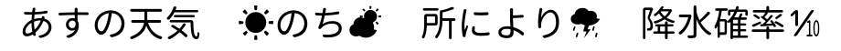
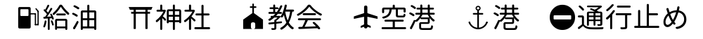
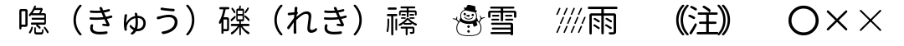
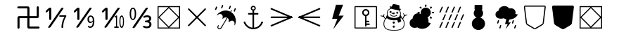
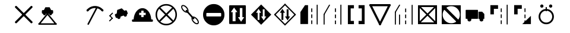
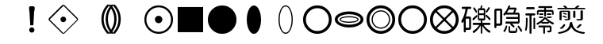

# Denpa Font

放送の字幕・データ放送・番組表で使う字 (JIS X 0208 と ARIB の外字など) を収めた、等幅の丸ゴシックです。
源柔ゴシック等幅 (源ノ角ゴシックを丸くしたもの) を元に、元に無い ARIB の記号などを源柔の字の部品と線の太さで描き足しています。

| | |
| --- | --- |
| ファミリ名 | `Denpa Font` |
| PostScript 名 | `DenpaFont-Regular` |
| em | 1024 (半角は半分の 512) |
| 入手 | [Releases](https://github.com/danything/denpa-font/releases) |
| ライセンス | [SIL Open Font License 1.1](LICENSE) |

| ファイル | 用途 |
| --- | --- |
| `denpa-font.ttf` | TrueType (fontconfig・Android など) |
| `denpa-font.woff2` | web フォント (ブラウザ) |
| `SHA256SUMS` | 上の2つの sha256 |

見本 (上: v1.1、下: v2.0):


描き足した字を字幕・番組表の並びで (v2.1):





## 名前を変えた理由

元にしていた「Rounded M+ 1m for ARIB」を入れている環境とぶつからないように、別の名前 (Denpa Font) にしました。
元の源ノ角ゴシックの予約フォント名 `Source` は名前に含めていません。

## 収めた字の範囲

**denpa の表だけを元にします。** [fetch.sh](fetch.sh) が [danything/denpa](https://github.com/danything/denpa) の表を版 (コミット) を固定して取り
(`DENPA_COMMIT`。Renovate が追う)、道具がそれを読みます。フォント側に表の写しは持ちません。

| 何のための字 | denpa の表 |
| --- | --- |
| 字幕 | `src/lib/ts/b24-tables.ts` (JIS X 0208 の割り当てのある区点、外字 85・86・90〜94 区、かな・英数・記号。漢字は EUC-JP との差分なので、EUC-JP は WHATWG の index-jis0208 で読む) |
| DRCS (局が絵で送る字) | 同じく `DRCS_REPLACE` の置き換え先 |
| 番組表などの外字 | `src/lib/ts/aribtext-gaiji.ts` (`EPG_ONLY`。ほかは字幕の追加記号と同じ) と、検索の寄せた先 (`src/lib/fold.ts` の `FOLD`) |
| データ放送 | `package.json` の web-bml の版の `jis_to_unicode_map.js` (npm から取り、denpa の `bun.lock` の sha512 で確かめる) と ASCII |

- 表はいずれ 1 つのファイルにまとまる予定なので、表の名前 (`HIRAGANA`・`GAIJI` など) をどのファイルからでも探します
- U+EC00〜ECBB は除きます (web-bml が自前で描く)
- 7,755 字。全部入っています ([missing.txt](missing.txt) は空)。ttf 4.2MB・woff2 1.5MB
- 絞っても字は変わりません (`verify` が絞る前と全字を比べる)。ヒンティングは残し、縦書きと OpenType の組版 (vhea/vmtx/GSUB/GPOS) は落としています
- 行の高さは v1.x と同じ (WinAscent 981 / WinDescent 168)
- カラー絵文字が既定の字 (🅿 ♨ ☎ ⚡ ⛅ ❗ ⁉ など) も白黒の形で入っています (`verify` が空白のほかに形の無い字が無いことを確かめる)

**字を足す流れ:** denpa の表に 1 行足す → denpa の CI が「フォントに無い字」を出して落ちる →
こちらの `DENPA_COMMIT` を上げる (Renovate の PR) → 元に無い字なら `tools/src/draw.rs` に描き方を足す → タグを打って版を出す →
denpa のフォントの版 (と sha256) を上げる。

## 元にしたフォントと描き足した字

| フォント | 版 | 配布元 |
| --- | --- | --- |
| 源柔ゴシック等幅 Regular | 1.002.20150607 | <http://jikasei.me/font/genjyuu/> |

配布元・版・sha256 は [fetch.sh](fetch.sh) に固定してあります。元にある字 (7,514 字) はそのまま運び、無い字は次のように作ります
(作り方の一覧はビルドのたびに `build/extras.txt` に出る)。描き方の数値 (線の太さ・縮め率など) は `tools/src/draw.rs` の頭にまとめてあります。

| 作り方 | 字 | 数 |
| --- | --- | --- |
| 同じ字形を指す | データ放送の外字の私用領域 (U+E0xx〜E3xx)。denpa の表で同じ区点の字 (92区26〜31 は 氏 副 元 故 前 新) | 125 |
| 元の字を縮めて並べる | 92区56〜85 の楽器の略記 ((vn) (ob) … (pe r))。元の半角の字を横 50%・縦 80% にして 1 マスに並べる | 30 |
| 描く | 下の 86 字 | 86 |

描いた字と描き方:

| 字 | 描き方 |
| --- | --- |
| ࿖ ⛄ ⛉ ⛊ | 源柔の 卍 ☃ をそのまま、☖ ☗ を逆さに |
| ⅐ ⅑ ⅒ ↉ | 源柔の ⅓ の分子・斜線・分母の置き場に、半角の数字を同じ高さで置く |
| ⌺ ⛋ ⛝ ⛞ ⛶ ⚿ | 源柔の □ と同じ枠・線の太さ (38) に、ひし形・ばつ・鍵などを足す |
| ⬤ ⬮ ⬯ ⭕ ⭖ ⭗ ⭘ ⭙ ⨀ ⟐ ⬛ ⦅ ⦆ ☓ ❗ | 源柔の ○ (半径 461・線 38) ◇ ■ （ に合わせた丸・楕円・輪 (太い輪は 92) |
| ☔ ⛅ ⛆ ⛇ ⛈ ⚡ | 源柔の ☂ ☀ ☁ と、同じ線の太さ (44) の雨・稲妻 |
| ⛌ ⛍ ⛐ ⛒ ⛓ ⛔ ⛕ ⛖ ⛗ ⛘ ⛙ ⛚ ⛛ ⛜ ⛟ ⛠ ⛡ ⛣ | 道路・交通の記号を、線 44・太い線 92・角の丸み 36 の単純な図形で |
| ⛨ ⛩ ⛪ ⛫ ⛬ ⛭ ⛮ ⛯ ⛰ ⛱ ⛲ ⛳ ⛴ ⛵ ⛷ ⛸ ⛹ ⛺ ⛻ ⛼ ⛽ ⛾ ⛿ ✈ ⚓ ⚞ ⚟ ⛏ ⛑ | 地図・施設の記号を、同じ数値の単純な図形で |
| 喼 䃯 鿅 | 源柔の字の偏 (吡 の 口・硎 の 石・祾 の 礻) と旁 (急・楽・澪 の 零) を横に縮めて組む |
| 𤋎 | 源柔の 煎 の 前 と 炎 の下の 火 を縦に縮めて組む |






## 候補の比較 (v2.0 で元を選んだとき)

| 候補 | 1 つで入る字 | 見た目の揃い方 |
| --- | --- | --- |
| 源柔ゴシック等幅 Regular (採用) | 7,632 / 7,752 (98.5%) | かな・漢字・記号が源ノ角ゴシックの 1 系統。半角英数は M+ |
| Rounded Mgen+ 1m regular | 7,632 (98.5%) | かなは M+、漢字は源ノ角ゴシック。2 系統が混ざる (v1.x の見え方には近い) |
| 和田研中丸ゴシック2004ARIB | 7,734 (99.8%) | 1 系統だが、かな・漢字の線が細めで形も源ノ角ゴシック・M+ と違う |

## ビルドとリリースの仕方

取ってくる・確かめる・ほどくのは [fetch.sh](fetch.sh) (curl・sha256sum・openssl・7z・tar)、フォントを作るのは Rust の道具 1 本
([tools/](tools)。依存は fontations の skrifa・write-fonts・skera と woff2 の ttf2woff2 だけ。道具はネットに触らない)。
Rust の版は [rust-toolchain.toml](rust-toolchain.toml)、依存は `tools/Cargo.lock` で固定してあります。同じ入力から同じバイト列ができます。

```sh
sh fetch.sh                                   # build/src に取ってくる
cargo build --release --locked --manifest-path tools/Cargo.toml
tools/target/release/denpa-font build 2.1     # → dist/denpa-font.ttf・.woff2
tools/target/release/denpa-font verify dist/denpa-font.ttf build/merged.ttf [--prev 前の版の ttf] [--woff2 woff2 を解いた ttf]
tools/target/release/denpa-font repertoire    # 収める字の一覧を見る
```

SHA256SUMS は CI のシェルが作ります。woff2 は CI が Google の `woff2_decompress` で解いて ttf と比べます。

`verify` が確かめること (PR・main・タグのたびに CI が動かす):

- 字の揃い (denpa の表の字が全部ある。[missing.txt](missing.txt) の字を除く)、空白のほかに形の無い字が無いこと
- 名前・em
- 絞る前後で字が同じ (ヒンティング無し・フォント自身のヒンティングで描いた輪郭と送り幅)
- 前の版から描き方が変わった字は [expected-changes.txt](expected-changes.txt) にあるものだけ (`*` は全部)。字を変える PR では同じ PR で書き、リリースのあと空に戻す
- woff2 を解いたものが ttf と同じ字になる

**版**: タグは `vX.Y` (例 `v2.1`)。元を替える・字を減らす・字の幅や行の高さを変えるときは X、字を足す・直すときは Y を上げます。フォントの版 (nameID 5) は `Version X.YYY`。タグを push すると GitHub Actions が作って確かめ、Releases に ttf・woff2・SHA256SUMS を置きます。

**以前のやり方からの移行**: v1.x は FontForge のスクリプト (`.pe`) とコピーリストで、v2.0 は Python (fontTools) で作っていました。v2.1 から Rust の道具だけで作ります。
v2.0 までは fontTools が字の外枠を測り直していたため、源柔の字のうち 73 字が左の余白と食い違って 2/1024 em ほど右にずれていました。v2.1 は元の字をそのまま運ぶので、元の源柔と同じ位置に戻ります。

## ライセンス

このフォントと作るための道具は [SIL Open Font License 1.1](LICENSE) で配布しています (元の源柔ゴシックと同じ)。
元にした字形は元のフォントの作者によるもので、元のフォントの著作権表示と許諾は次のとおりです。

### 源柔ゴシック (源ノ角ゴシック + M+ OUTLINE FONTS)

```text
Copyright © 2014, 2015 Adobe Systems Incorporated (http://www.adobe.com/), with Reserved Font Name 'Source'.
Copyright(c) 2015 M+ FONTS PROJECT

This Font Software is licensed under the SIL Open Font License, Version 1.1.
```

源柔ゴシックの M+ OUTLINE FONTS 由来の字形は、次の M+ FONTS LICENSE に基づいています。

```text
These fonts are free software.
Unlimited permission is granted to use, copy, and distribute them, with
or without modification, either commercially or noncommercially.
THESE FONTS ARE PROVIDED "AS IS" WITHOUT WARRANTY.
```

### クレジット

Adobe (源ノ角ゴシック)、M+ FONTS PROJECT (M+ OUTLINE FONTS)、自家製フォント工房 (源柔ゴシック)。
v1.x は「Rounded M+ 1m for ARIB」(自家製 Rounded M+ 1m + 和田研中丸ゴシック2004ARIB) を、v2.0 は ARIB の記号の一部に和田研中丸ゴシック2004ARIB を使っていました。
